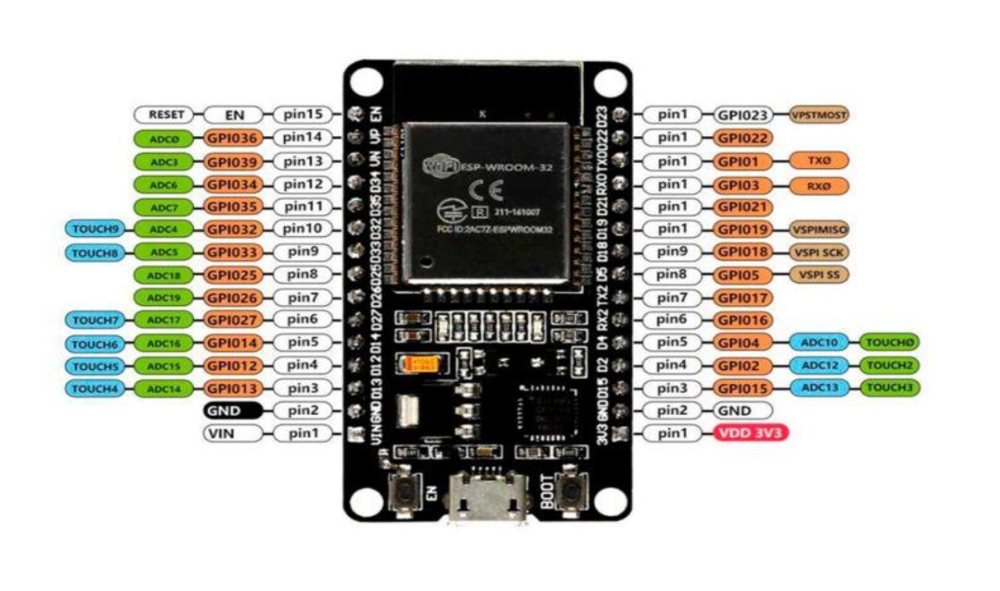
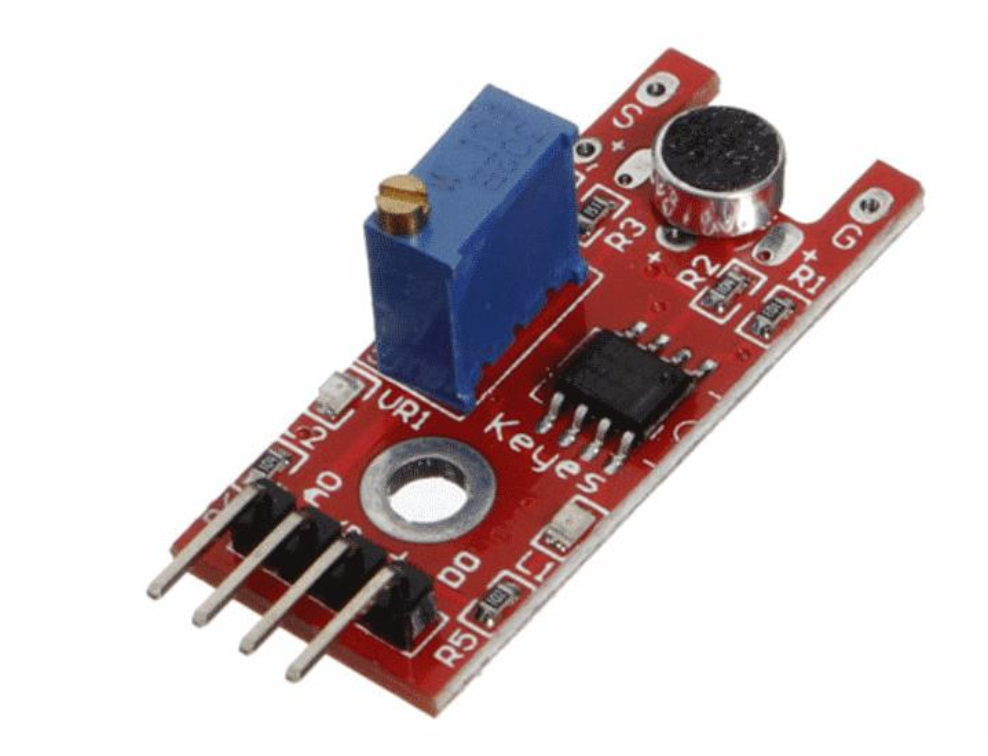
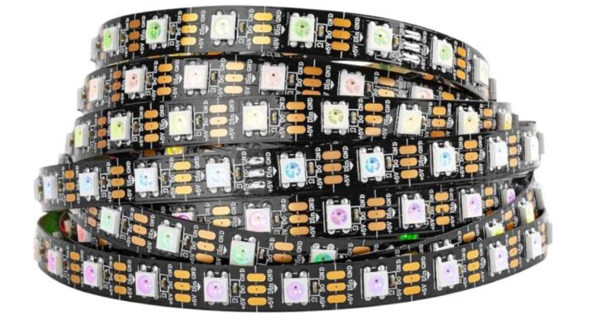
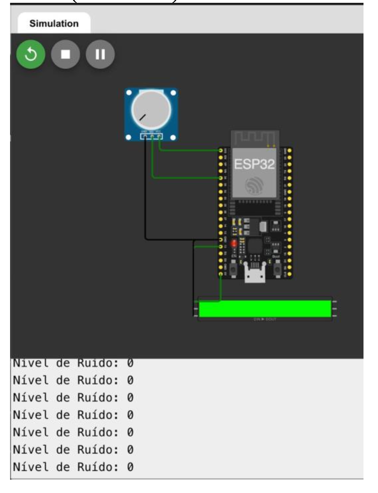
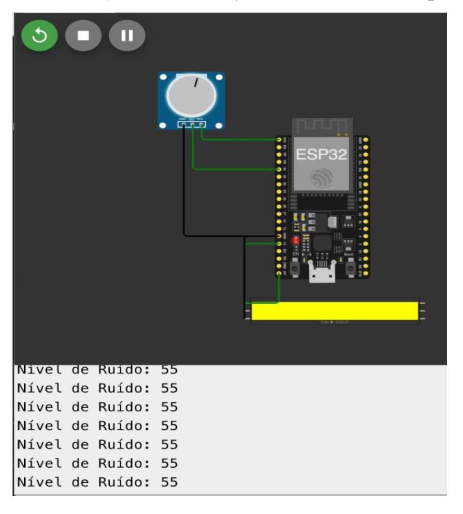
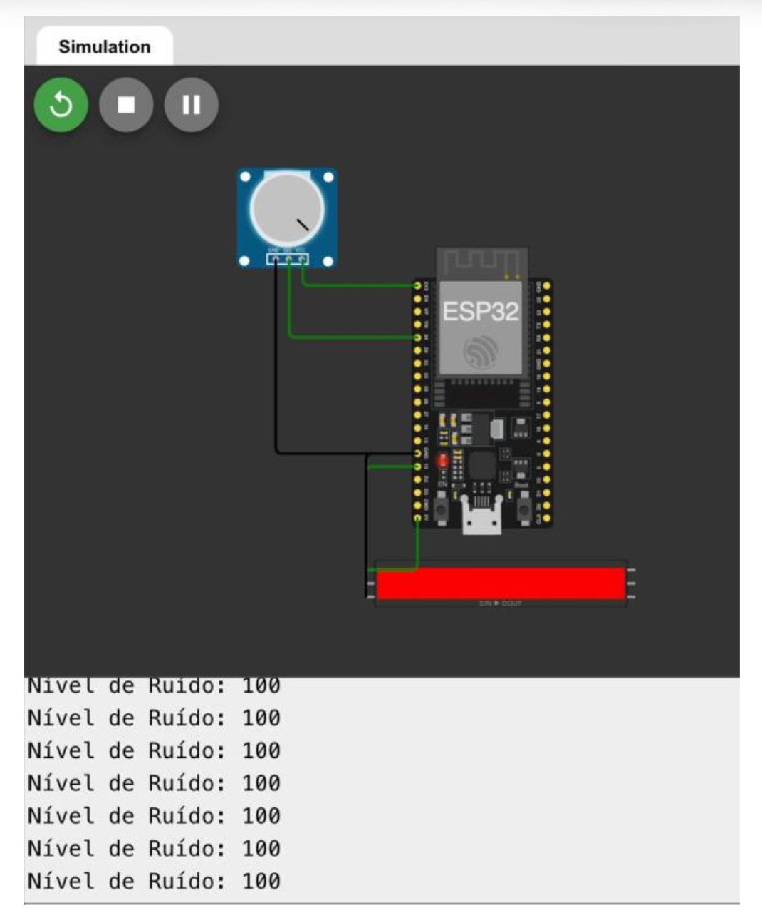

# UrbanQuiet: Ambient Display IoT para Monitoramento e Conscientização da Poluição Sonora Urbana

Este repositório contém a documentação técnica, o firmware e o dashboard de controle e monitoramento do projeto **UrbanQuiet**. Desenvolvido como um Objeto Inteligente Conectado, o UrbanQuiet visa mitigar a poluição sonora urbana em zonas críticas (como hospitais, escolas e áreas residenciais), fornecendo feedback visual imediato ao ambiente e coletando telemetria para mapeamento acústico em tempo real, alinhado ao **Objetivo de Desenvolvimento Sustentável 11 (Cidades e Comunidades Sustentáveis)** da ONU.

---

## 1. Estrutura de Pastas do Repositório

A organização do projeto segue a estrutura padrão de projetos de Objetos Inteligentes Conectados:
* `[codigo/](codigo)`: Código-fonte do firmware do ESP32 (`urbanquiet.md`) e da interface do dashboard web (`index.html`).
* `[docs/](docs)`: Documentos oficiais do projeto, incluindo o [artigo.pdf](docs/artigo.pdf).
* `[imagens/](imagens)`: Imagens do hardware, da prototipagem e capturas de tela dos experimentos de latência.

---

## 2. Descrição de Funcionamento Geral

O UrbanQuiet opera em um ciclo contínuo de amostragem acústica, processamento de borda e comunicação em rede:
1. **Captação de Áudio**: O sensor de som capta as ondas de pressão sonora locais continuamente.
2. **Processamento e Mapeamento**: O microcontrolador ESP32 processa os dados analógicos através de uma janela de amostragem de 50ms para extrair a amplitude da onda sonora. Essa amplitude é mapeada localmente para uma escala de 0 a 100% de intensidade de ruído.
3. **Feedback Físico (Ambient Display)**: A matriz/fita de LEDs exibe cores dinâmicas para conscientização imediata no local:
   * **Verde (< 25%)**: Som Ambiente Seguro.
   * **Amarelo (25% - 80%)**: Som Limite / Atenção.
   * **Vermelho (> 80%)**: Ruído Alto / Crítico.
4. **Telemetria de Rede (MQTT)**: A cada 1 segundo, o ESP32 envia um pacote JSON contendo o percentual de ruído, a classificação de risco e o timestamp interno do microcontrolador (`millis()`) para um Broker MQTT em nuvem.
5. **Dashboard Web (Visualização e Controle)**: Um dashboard HTML5 consome os dados do broker em tempo real, gerando um gráfico dinâmico, exibindo os impactos à saúde segundo a Organização Mundial da Saúde (OMS) e permitindo realizar medições de latência para auditorias de desempenho de rede.

---

## 3. Descrição de Hardware Utilizado

O hardware foi projetado para ser acessível, modular e replicável. A arquitetura física é descrita a seguir:

* **Plataforma de Desenvolvimento**: ESP32 DevKit V1 (Processador Dual-Core Xtensa 32-bit LX6 operando a 240 MHz, Wi-Fi 802.11 b/g/n integrado, Conversor Analógico-Digital (ADC) de 12 bits com resolução de 4096 níveis).
  
  

* **Sensor Acústico**: Módulo Sensor de Som KY-038, composto por um microfone de condensador de alta sensibilidade e um comparador analógico LM393.
  
  

* **Atuador Visual**: Fita ou Matriz de LED RGB WS2812B (endereçável, alimentação 5V, protocolo de controle por pino único de dados).
  
  

* **Alimentação**: Fonte externa estabilizada de 5V DC com capacidade de corrente de 2A, necessária para suportar picos de corrente da fita de LEDs e a antena Wi-Fi do ESP32.

### Esquema de Pinagem e Conexões

| Componente | Pino do Componente | Pino do ESP32 | Função |
| :--- | :--- | :--- | :--- |
| **Sensor de Som KY-038** | AO (Analog Out) | **GPIO 34 (ADC1_CH6)** | Envio da leitura analógica de tensão correspondente ao som captado |
| **Sensor de Som KY-038** | GND | **GND** | Aterramento comum |
| **Sensor de Som KY-038** | VCC | **3V3** | Alimentação positiva do sensor |
| **Fita LED WS2812B** | DIN (Data In) | **GPIO 32** | Linha de dados de alta velocidade (controle de cores) |
| **Fita LED WS2812B** | GND | **GND** | Aterramento comum (acoplado com o GND do ESP32 e da fonte) |
| **Fita LED WS2812B** | 5V | **Fonte Externa 5V** | Alimentação principal do atuador |

*Nota: É mandatório unificar os potenciais de referência conectando o terminal negativo (GND) da fonte externa de 5V ao pino GND do ESP32.*

---

## 4. Interfaces, Protocolos e Módulos de Comunicação

O canal de transporte e interação é baseado no protocolo de mensageria leve **MQTT** (Message Queuing Telemetry Transport), rodando sob a pilha de protocolos **TCP/IP**.

### Infraestrutura de Rede
* **Broker Utilizado**: HiveMQ Cloud (`broker.hivemq.com`).
* **Porta de Conexão do ESP32 (TCP/IP padrão)**: `1883`
* **Porta de Conexão da Dashboard (WebSockets)**: `8000` (permite que o cliente web no navegador se comunique via WebSocket nativo).

### Tópicos e Payloads

#### 1. Telemetria do Sensor (`urbanquiet/ruido`)
* **Fluxo**: ESP32 (Publisher) $\rightarrow$ Broker $\rightarrow$ Dashboard (Subscriber).
* **Frequência**: 1 segundo.
* **Formato**: JSON.
* **Payload Exemplo**:
  ```json
  {
    "ruido": 45,
    "status": "Som Limite",
    "t_esp": 45120
  }
  ```
  *(Onde `t_esp` é o valor de `millis()` do ESP32 no instante da captação).*

#### 2. Calibração de Tempo (Ping-Pong)
* **Tópico de Envio (`urbanquiet/ping`)**: O dashboard envia uma mensagem com seu timestamp atual: `"1717250000000"`.
* **Tópico de Resposta (`urbanquiet/pong`)**: O ESP32 escuta o ping e envia imediatamente a resposta combinada: `"1717250000000,45210"` *(timestamp de origem, tempo local do ESP32 em ms)*.
* **Lógica Matemática**:
  Ao receber o Pong, o dashboard calcula o atraso de ida e volta (RTT):
  $$RTT = T_{recebimento\_pong} - T_{envio\_ping}$$
  O offset temporal ($\Delta$) entre o relógio do navegador e o ESP32 é calibrado por:
  $$\Delta = \left(T_{envio\_ping} + \frac{RTT}{2}\right) - T_{esp}$$
  O cálculo do offset médio é realizado a partir de **4 medições sequenciais** para garantir estabilidade estatística.

#### 3. Controle do Atuador
* **Tópico de Comando (`urbanquiet/comando`)**: O dashboard publica um sinal de comando contendo o timestamp de envio: `"1717250010000"`.
* **Tópico de Confirmação (`urbanquiet/confirmacao`)**: O ESP32 processa o comando, acende os LEDs em azul por 1 segundo e publica a confirmação: `"1717250010000,45320"`.
* **Cálculo de Latência do Atuador**:
  $$Lat\hat{e}ncia_{atuador} = (T_{acao\_esp} + \Delta) - T_{envio\_comando}$$

---

## 5. Software Desenvolvido e Documentação de Código

### Firmware do ESP32 (`codigo/urbanquiet.md`)
O firmware foi desenvolvido em C++ sob a Arduino IDE usando a biblioteca **PubSubClient** para comunicação MQTT e **Adafruit_NeoPixel** para controle físico dos LEDs. 

* **`setup()`**: Configura pinos, inicializa a fita LED, desativa a proteção Brown-Out (`WRITE_PERI_REG(RTC_CNTL_BROWN_OUT_REG, 0)`) para evitar resets devido a picos de corrente da antena Wi-Fi, inicia a conexão Wi-Fi e configura o servidor e callback MQTT.
* **`loop()`**:
  * Mantém a conexão ativa chamando `reconnect()` e processa eventos com `client.loop()`.
  * Executa a amostragem em lote analógica de alta velocidade por 50ms para filtrar ruídos elétricos do sensor KY-038.
  * Realiza a gerência visual (priorizando luz azul por 1 segundo se houver comando de atuador pendente).
  * Envia dados formatados em JSON a cada 1000ms.
* **`callback(...)`**: Escuta os tópicos de ping e comando, disparando as ações de atuador correspondentes e publicando os resultados imediatamente.

### Dashboard Frontend (`codigo/index.html`)
Desenvolvido em HTML5/CSS3 baunilha com JavaScript puro para garantir responsividade e leveza.

* **Integração Gráfica**: Utiliza a biblioteca **Chart.js** via CDN para desenhar o gráfico em tempo real de nível de ruído e o gráfico comparativo de latência dos resultados das 4 baterias de teste.
* **Lógica de Análise de Risco OMS**: Mapeia o valor analógico relativo do sensor em decibéis equivalentes ($30\text{ dB}$ a $120\text{ dB}$). Baseado nas normas de poluição sonora da OMS, indica graficamente as classificações e limites permitidos de exposição contínua sem danos ao sistema auditivo humano.
* **Lógica de Sincronização e Coleta (Item 7 do Artigo)**: O JavaScript gerencia as tabelas e calcula as médias aritméticas de latência com base nos timestamps sincronizados de forma transparente e amigável.

---

## 6. Resultados e Funcionamento do Protótipo (Simulação Wokwi)

O protótipo do **UrbanQuiet** foi simulado e verificado no ambiente virtual **Wokwi**, demonstrando o correto acionamento físico do atuador de acordo com os níveis de ruído medidos:

### Cenário 1: Nível de Ruído 0% (Verde - Som Ambiente Seguro)
Quando o ruído detectado está em níveis confortáveis (abaixo de 25% ou 50 dB), a fita de LEDs acende na cor **verde**, indicando que o ambiente está silencioso e em conformidade.


### Cenário 2: Nível de Ruído 55% (Amarelo - Alerta / Limite de Ruído)
Ao atingir níveis moderados de ruído (maiores que 25% e menores que 80%, ex: 55% ou 80 dB), a fita de LEDs transita imediatamente para a cor **amarela**, servindo como alerta visual no ambiente.


### Cenário 3: Nível de Ruído 100% (Vermelho - Alerta Crítico / Risco Alto)
Em situações de ruído elevado (superior a 80%, ex: 100% ou acima de 100 dB), a fita de LEDs assume a cor **vermelha**, sinalizando poluição sonora crítica e perigo à saúde auditiva.


---

## 7. Vídeo de Apresentação e Demonstração

Assista à apresentação completa do projeto, com explicações sobre o conceito, a demonstração do protótipo rodando localmente e o funcionamento prático do dashboard web no YouTube:

[](https://youtu.be/VgzfqdxcMQw)

> [!NOTE]
> Clique na imagem acima ou utilize o link direto para assistir: [Apresentação do Projeto UrbanQuiet no YouTube](https://youtu.be/VgzfqdxcMQw).

---

## 8. Instruções de Reprodução e Execução

### Pré-requisitos de Software
1. **Arduino IDE** (v1.8 ou superior).
2. Instalar a placa **ESP32** no gerenciador de placas da IDE.
3. Instalar as bibliotecas **PubSubClient** e **Adafruit_NeoPixel** através do Gerenciador de Bibliotecas.

### Configuração Física
1. Realize as conexões entre o ESP32, o sensor KY-038 e a fita LED WS2812B conforme a tabela de pinagem do item 3.
2. Certifique-se de ligar o GND da fonte de 5V ao GND do ESP32.

### Configuração do Firmware
1. Abra o arquivo `codigo/urbanquiet.md` na Arduino IDE.
2. Modifique as constantes `ssid` e `password` com o nome e a senha do seu Wi-Fi local.
3. Grave o código no ESP32.
4. Abra o Monitor Serial a `115200` bps para conferir os logs de conexão com a rede e com o Broker.

### Execução da Dashboard
1. Abra o arquivo `codigo/index.html` diretamente no seu navegador.
2. Certifique-se de estar conectado à internet. O cabeçalho da página deve atualizar o status para **"Broker Online"** em poucos segundos.
3. O status de Calibração mudará para **"Calibrado"** assim que a sequência de 4 pings automáticos for processada com o hardware.

### Execução do Experimento de Latência (Item 7)
1. Deixe o ESP32 rodar. As primeiras 4 mensagens enviadas por ele serão capturadas automaticamente pela dashboard e preencherão a **Tabela de Latência do Sensor**. O tempo médio será calculado e o gráfico de barras atualizará.
2. Pressione o botão **"Acionar Atuador"** na dashboard por 4 vezes para preencher a **Tabela de Latência do Atuador** e registrar o comportamento no gráfico de barras.
3. Você pode capturar a tela das tabelas e do gráfico gerado diretamente para usar no capítulo de Resultados do seu artigo.

---

## 👥 Integrantes do Grupo e Autores

Este projeto foi concebido e implementado pelos seguintes integrantes, como parte do artigo científico desenvolvido para a Faculdade de Computação e Informática (FCI) da Universidade Presbiteriana Mackenzie:

* **Anny Violeta Rodrigues Freire**
* **Guilherme Henrique Ferraz Contrera**
* **Vinicius Santos Ribeiro**
* **Andre Luiz de Oliveira**
* **Leandro Carlos Fernandes**
